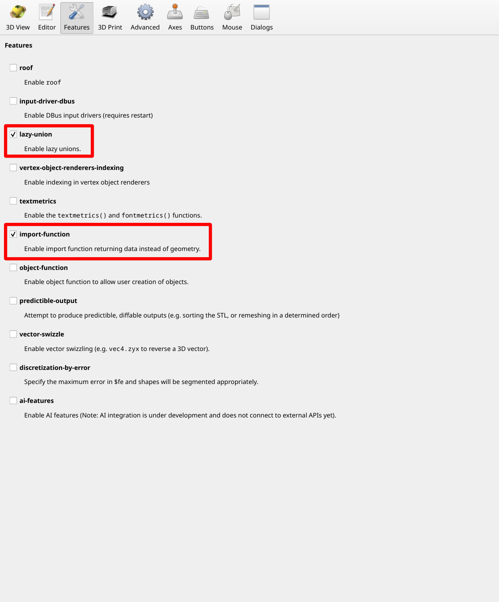
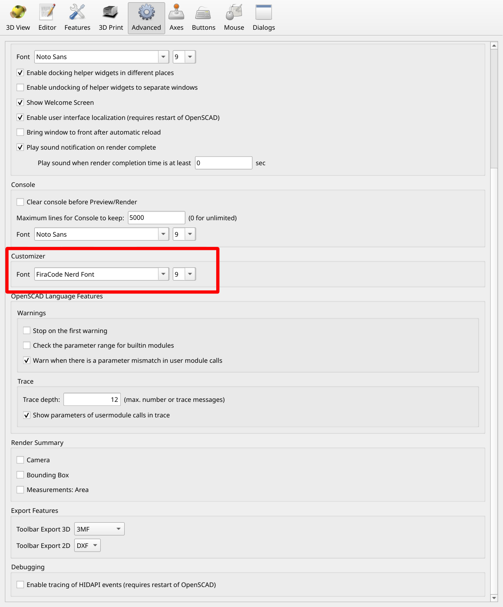
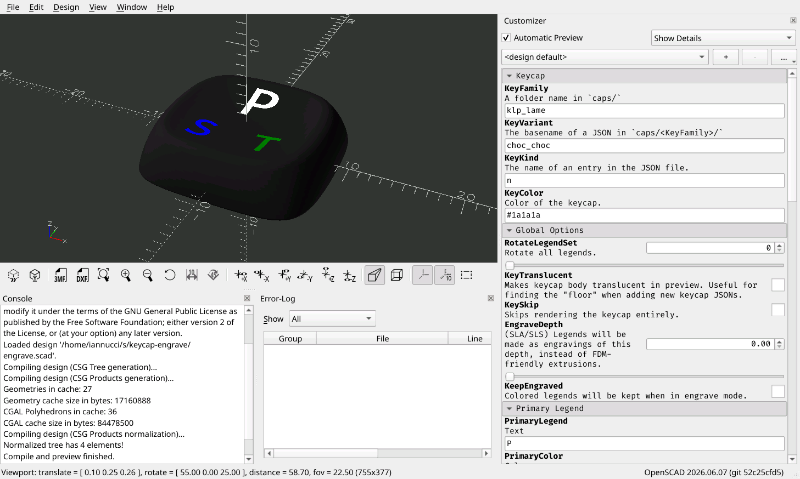

# Custom Keycap Engraver

This repo is built around a simple(?) OpenSCAD program, `engrave.scad` which
allows loading a keyboard keycap STL, and then inscribing legends into it.

The ultimate intent is to be able to generate a full keyboard worth of keycaps,
so that they can be 3D printed (either at home or by sending them off to a
service with an SLS machine). If you're interested in this, then *probably*
you'd be fine with totally unlabeled keys, too, but I like the aesthetic of
labeled keys, already know how to touch type, and it also helps when explaining
for my QWERTY-oriented friends).

I wrote this as a spinoff of [coredump/keycap-legends], which was a great intro
to the topic, but a tad too slow (generating a single key took something like
10s on my machine, `engrave.scad` takes about 0.2s), buggy (certain legend
settings caused the script to crash) and rigid (extending it to e.g. correct for
projection on tilted keycaps was pretty tricky) for my tastes (something
something vibecode something :smile:). I'm sure I could have poked and prodded
an agent to get something better, but I enjoyed doing this one the old fashioned
way (and now I have a basic understanding of OpenSCAD, which is neat!). Plus,
this one doesn't require anything other than the base OpenSCAD and python3,
which is nice.

## Results

Here's my lily58 with [KLP Lamé] keycaps made with these scripts:

> TODO: Actually take a photo when the keyboard is done lol ^\_^.

## Quickstart

### Prerequisites

Get the [OpenSCAD] *development snapshot*. I used `2026.06.07 (git 52c25cfd5)`
successfully, but it's likely that newer versions will work fine.

In particular, this repo requires the following 'experimental' features of
OpenSCAD to work properly:

- `lazy-union` - Without this, OpenSCAD will only emit an STL with the keycap
  body and legend inserts unioned together, making it impossible to assign
  different materials to them in e.g. a slicer.
- `import-function` - Without this, `engrave.scad` will not be able to load the
  keycap JSON files specified by the `KeyFamily` and `KeyVariant` parameters.

### Playing around with the customizer

Once you have OpenSCAD, you can just do `openscad engrave.py` and it should open
with the customizer panel prepopulated with some useful basic configuration.

> [!NOTE]
>
> If this is the first time you're opening OpenSCAD, you will need to do a bit
> of extra setup.
>
> <details>
> <summary>Extra one-time UI setup.</summary>
>
> To make the OpenSCAD UI display keycaps properly, you must first enable
> `lazy-union` and `import-function` features. This is not necessary for
> directly using `engrave.py` because it enables these explicitly on the command
> line.
>
> 
>
> Additionally, if you want to use a custom font and want the Customizer view of
> the font to be accurate, you should also adjust this in the UI as well. This
> is not necessary for getting an accurate preview in the atual model viewport,
> just on the customizer pane.
>
> 
>
> </details>

From here you should see something that looks like this (there may be a lot of
extra little panels for e.g. font selection, colors, animation, etc.. You can
safely close them all by clicking the small `x` in their top right corners):



From here you can play with the settings in the customizer UI on the side, and
you should see OpenSCAD preview the changes fairly quickly (less than a second).

When you've got a feel for the settings you like, you can move on to generating
all the keys for your keyboard at the same time.

### Generating engraved caps

Ok, now we're ready to Get Serious :tm: and generate a whole keyboard.

This can be done with `engrave.py caplist.toml`. Running this will (re)produce
`engrave.json`, which the OpenSCAD UI will automatically load when loading
`engrave.scad`, and will use to pre-populate the customizer with presets, one
for each key on your keyboard.

Customizing your keyboard comes down to customizing your own TOML file. See the
[caplist.toml syntax](#caplist-toml).

## Repo Layout

### engrave.py

This is the main 'high level' script for generating a whole keyboard's worth of
keys at a time. It consumes a Caplist TOML, spits out an OpenSCAD 'customizer'
JSON (one preset per key), then optionally renders every key to `3mf`s ready to
send to your favorite slicer/print shop.

#### Caplist TOML

The [`caplist.toml`](./caplist.toml) file has my particular keyboard layout, but
should be a good jumping off point for anyone else intending to make a
customized keyboard layout.

It's syntax is [TOML](toml.io), and the expected fields are roughly:

- `batch`: Settings for how to group rendered 3mf keycaps for printing.
  - `size`: The target number of keycaps to include in a batch.
- `colors.XXX`: Color mapping to allow the rest of the spec to use logical color
  names instead of OpenSCAD color names like "white" or hexadecimal color codes.
  Keys in this map are logical color names, and values are valid OpenSCAD
  colors. Ex. `aux = "#F99963"` means that elsewhere in the config, color fields
  can use `$aux` and get this nice creamy orange color instead.
- `default`: A `Keycap` object to use as defaults for rows. See
  [Keycap object](#keycap-object) below for syntax.
- `rows.XXX`: Mapping of named rows to a hybrid Keycap/PluralKeycap. The names
  can be anything you like; I used `r0`, etc. for the regular rows, then
  `thumbs` for my oddball thumb keys on my lilly58, but you can name them
  however you like. The values are both a [Keycap object](#keycap-object) as
  well as a [Plural Keycap object](#plural-keycap-object). The base Keycap
  object forms defaults for this row, and are applied on top of the top level
  `default` section. The keycaps described by the PluralKeycap represent further
  overrides applied on top of this base, and usually form the actual key caps
  which will be emitted by the script. Note that if you set any legends in the
  base Keycap, it will count as a renderable keycap, and will be included in the
  output/as a preset as well. This can be useful where you have e.g. a single
  centered key - you can just give it its own row and configure it directly as a
  Keycap without worrying about Plural Keycap stuff.

Any place where a specific value overrides the default, you can supply `[]` (an
empty array) to indicate that this place should override back to that field's
default (empty) value. So, say you had `primary.size = 6`, but in one particular
row you wanted this to assume the default (which is currently `4`), you could
use `primary.size = []` in that row to indicate this. I would have used `null`,
but TOML is too cool to support null. Oh well.

`engrave.py` will consume this document and will emit ANY keycap which has any
non-empty legends at all. It produces `engrave.json` (for use with OpenSCAD
preview), and will also use the `openscad` CLI tool to directly produce batched
3mf files in the output/ directory. If `batch.size` is zero, no batching will
occur.

Batching works by categorizing keys by:

- key family, variant, kind
- key color
- primary, secondary and tertiary colors (it does not currently account for
  differently shifted legends!)
- legend rotation

Then filling batches up for each category up to `batch.size`. The intent is to
group together keys which will print similarly and will be able to take
advantage of shared filament changes at around the same layers (for multi-color
FDM). You probably want to set this to zero for SLA/SLS.

##### Example

You can see a live example in the repo's [caplist.toml](./caplist.toml), but for
ease of README, here is a small annotated example which defines a 5-key keyboard
with 2 rows of different length.

```toml
colors.light = "white"   # An OpenSCAD named color
colors.dark = "#1A1A1A"  # A nice dark grey.
colors.aux = "#F99963"   # An orangey color.
colors.bonus = "#56B7E6" # An blueish color.

[default]
family = "klp_lame"
variant = "choc_choc"
color = "$dark"  # references our custom color table above
primary.size = 4
primary.color = "$light"
primary.font = "FiraCode Nerd Font:style=Medium"
secondary.size = 3
secondary.color = "$aux"
secondary.font = "FiraCode Nerd Font:style=Medium"
# To keep things simple, we only use primary/secondary here.

[rows.top]
kind = "nt"  # this is 'normal tilted' in caps/klp_lame/choc_choc.json

# Now define key 0 as "A_" and key 1 as "B+" using the plural array syntax.
primaries.legend   = ["A", "B"]
secondaries.legend = ["_", "+"]

[rows.bottom]
# Same type for the example, but we're going to rotate these.
kind = "nt"  
# These will have the legends 'upside down', meaning our tilt is away from us
# on the row closer to us.
rotate = 180 

primaries.legend = ["X", "Y", "Z"]
# We only want a secondary legend on the middle key, so use the sparse array
# syntax. Let's color the "!" a different color, too.
secondaries.legend.1 = "!"
secondaries.color.1 = "$bonus"
```

##### Keycap object

Keycap objects in the TOML have the following fields:

- `family` (str) - The [keycap family](#keycap-definitions).
- `variant` (str) - The [keycap variant](#keycap-definitions).
- `kind` (str) - The [keycap kind](#keycap-definitions).
- `color` (str) - The OpenSCAD or logical color (e.g. `$aux`).
- `primary` ([Legend](#legend-object)) - The primary legend.
- `secondary` ([Legend](#legend-object)) - The secondary legend.
- `tertiary` ([Legend](#legend-object)) - The tertiary legend.
- `rotate` (float, degrees) - How much to rotate the legend.
- `translucent` (bool) - See the [`KeyTranslucent`](#opt-key-translucent)
  option.
- `skip` (bool) - See the [`KeySkip`](#opt-key-skip) option.
- `engraveDepth` (float) - See the [`EngraveDepth`](#opt-engrave-depth) option.
- `keepEngraved` (bool) - See the [`KeepEngraved`](#opt-keep-engraved) option.

##### Legend object

Legend objects in the TOML have the following fields:

- `legend` (str) - Legend text.
- `font` (str) - The [OpenSCAD font].
- `size` (str) - The size of the text.
- `shiftXY` ([float, float]) - Shift the legend on the face of the keycap. See
  [`{XXX}VecXY`](#opt-leg-vecxy).
- `translucent` (bool) - See the [`{XXX}Translucent`](#opt-leg-translucent)
  option.
- `skip` (bool) - See the [`{XXX}Skip`](#opt-leg-skip) option.

##### Plural Keycap object

Plural Keycap objects are 'special'. A Keycap object defines a single keycap,
but a Plural Keycap allows the definition of many keycaps. Instead of having an
array of Keycap objects to define many keycaps, a Plural Keycap has an array
per-Keycap-option.

Rows are a union of all [Keycap fields](#keycap-object) plus the following:

- `families` - Corresponds to `Keycap.family`.
- `variants` - Corresponds to `Keycap.variant`.
- `kinds` - Corresponds to `Keycap.kind`.
- `colors` - Corresponds to `Keycap.color`.
- `primaries` - Corresponds to `Keycap.primary`.
- `skips` - Corresponds to `Keycap.skips`.
- `engraveDepths` - Corresponds to `Keycap.engraveDepth`.
- `keepEngraveds` - Corresponds to `Keycap.keepEngraved`.
- `secondaries` (`recursive`) - Corresponds to `Keycap.secondary`.
- `tertiaries` (`recursive`) - Corresponds to `Keycap.tertiary`.
- `rotations` (`recursive`) - Corresponds to `Keycap.rotate`.

(The fields marked (`recursive`) are special; I'll talk about those below the
example)

The values are either an array of values whose type matches, or a 'sparse array'
of such values. An array is just what you think it is, a list of values (e.g.
strings). Sparse arrays in this config file are an object whose keys are
indexes, and whose values are the value to use at that index.

So if you wanted to set the keycap color on a key-by-key basis, you could do
something like this with the array syntax:

```toml
# The default keycap color for all keys in this row.
color = "purple"
# Describes the colors of keys 0, 1, and 3 in this row. Key 2 gets the default (purple).
colors = ["white", "black", "", "black"]
```

Or with the sparse array syntax:

```toml
# The default keycap color for all keys in this row.
color = "purple"
# Describes the colors of keys 0, 1, and 3 in this row. Key 2 gets the default (purple).
colors.0 = "white"
colors.1 = "black"
colors.3 = "black"
```

The `recursive` fields are special. In particular, their type is
[Legend](#legend-object), which is an object, not a primitive type. It would be
pretty crummy to have to have an array of objects when you just want to set the
legend text for a bunch of keys, so the TOML loader applies this array parsing
behavior to the keys of this pluralized object, instead.

As an example, to set a bunch of legend text, without changing any other aspects
of the legends (like font or color), you can do:

```toml
primaries.legend = ['A', 'B', 'C']
# just add '!' as a secondary legend for 'B'
secondaries.legend.1 = '!' 
```

This is probably a bit confusing, but it makes for very readable config files.
Check out the live config example in [`caplist.toml`](./caplist.toml).

### engrave.scad

`engrave.scad` is the core of the magic in this repo. It implements all the
model/font manipulation logic to generate useful geometry for printing.

#### Keycap Definitions

Keycaps are defined in the `caps/` directory, with each directory describing a
separate `family` of keycaps, with one or more `variant`s. Each variant is
represented by a uniquely named JSON file, which tells `engrave.scad` where to
find the STL for one or more particular keycap `kind`s within this
family+variant combination.

Each keycap family has an `upstream` subdirectory (a Git submodule) which has
the actual model files.

See [Options](#options) for current key families with links to their OG sources
which have renderings of the base keycaps.

##### Keycap JSON

The keycap JSON has a pretty basic format. It's an object, with each key of the
object representing one, named, keycap. In addition, the key `$default` is used
to make some common base settings for each individual keycap.

Each of these keycap definitions is an object with the following keys:

- `rootPath` - Relative path within `upstream/` of the root of the model files.
- `stl` - Relative path from `upstream/{rootPath}/` of where to find the STL for
  this keycap.
- `tilt` - Degrees to tilt the keycap to orient so that it's face normal is
  exactly along Z.
- `floor` - Offset plane from Z of the non-rotated keycap for what is considered
  safe to engrave. `engrave.scad` will not extrude geometry below this plane.

See the [KLP Lame Choc+Choc](./caps/klp_lame/choc_choc.json) definition for an
example.

#### Options

`{XXX}` below means `Primary`, `Secondary`, or `Tertiary`, refering to the three
possible legends which can be carved into the keycap.

- `KeyFamily` - A folder name under `caps/` in this repo. Currently:
  - [klp_lame](https://github.com/braindefender/KLP-Lame-Keycaps)
  - [clp_keycaps](https://github.com/vvhg1/clp-keycaps)
  - [subliminal_contradiction](https://github.com/pseudoku/Subliminal-Contradiction)
- `KeyVariant` - The name of one of the Keycap JSON files.
- `KeyKind` - The name of one of the keys in the Keycap JSON files.
- `KeyColor` - A valid OpenSCAD color.
- `RotateLegendSet` - Rotate all the legends around the keycap's normal vector
  by this many degrees.
- `KeyTranslucent` <a name="opt-key-translucent"></a>- In preview mode, this is
  useful for seeing the interior extrusion of the legends into the keycap model.
- `KeySkip` <a name="opt-key-skip"></a>- Skip emitting the model entirely (e.g.
  just output the legend models).
- `EngraveDepth` <a name="opt-engrave-depth"></a>- For SLA/SLS printing (or
  monochrome FDM printing) where you intend to fill in the legend manually in
  some way (or just leave it as a shallow indentation). If this is zero, then
  the model will extrude legend models into the keycap model along the true Z
  axis (not the keycap face normal vector) down to the keycap floor. With this >
  0, it will instead do an engrave extruded along the face normal with an even
  depth along the face of the keycap. The intent is for SLA/SLS prints where you
  will fill the legends in as a post-processing step somehow.
- `KeepEngraved` <a name="opt-keep-engraved"></a>- If `EngraveDepth` is > 0,
  keep the engraved legend models anyway.
- `{XXX}Legend` - The text to use for this legend. If blank, this legend will be
  skipped.
- `{XXX}Color` - The color to use for this legend.
- `{XXX}Font` - The [OpenSCAD font] string to use for this legend.
- `{XXX}Size` - The text size to use for this legend (~= the height of the
  rendered text).
- `{XXX}VecXY` <a name="opt-leg-vecxy"></a>- An `[X, Y]` vector on the plane
  perpendicular to the keycap's face in which to slide this legend's text from
  center. `[0, 0]` would be dead center.
- `{XXX}Skip` <a name="opt-leg-skip"></a>- Boolean indicating that this legend
  should be skipped when rendering the output key. This legend will still be
  engraved into the model (assuming the `{XXX}Legend` is not empty), but the
  geometry for the actual legend will be omitted.
- `{XXX}Translucent` <a name="opt-leg-translucent"></a>- Boolean indicating that
  this legend will be rendered as translucent in the OpenSCAD preview.

## Notes on 3D printing keycaps

### FDM

### SLS/SLA

[coredump/keycap-legends]: https://github.com/coredump/keycap-legends
[klp lamé]: https://github.com/braindefender/KLP-Lame-Keycaps
[openscad]: https://openscad.org/
[openscad font]: https://en.wikibooks.org/wiki/OpenSCAD_User_Manual/Text#Using_Fonts_&_Styles
